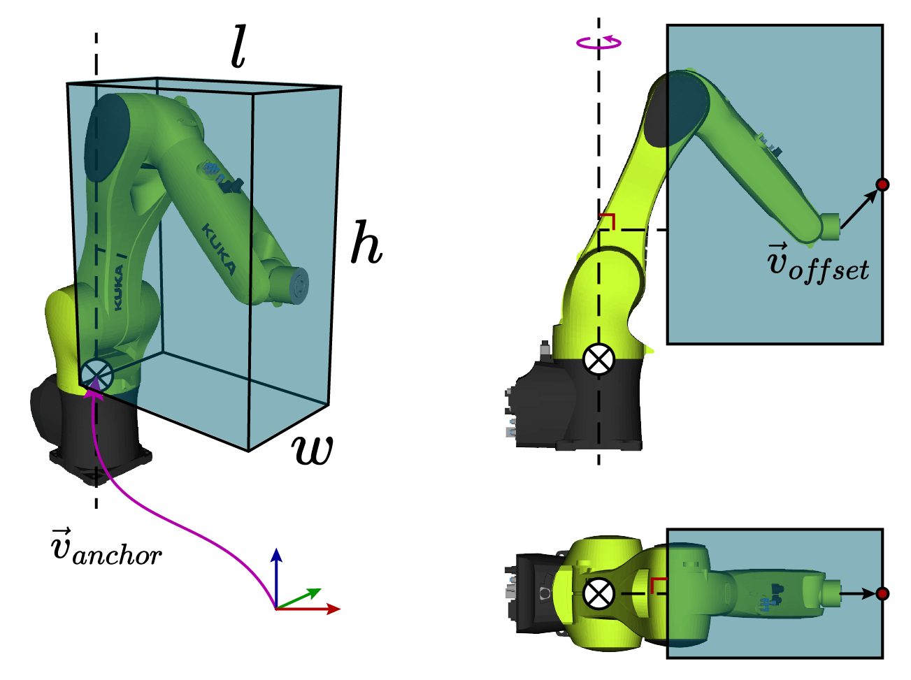

.. _python_examples:

===============
Python Examples
===============

A few Python examples are provided in :file:`examples/example.py`. The basic
components of these examples, such as creating toolpaths and defining robot
systems, are explained below. First, :ref:`install <installation>` pyrobopath,
then cd to the :file:`examples` directory, and run the following command:

.. code-block:: sh
  :caption: Run the provided examples

  python3 examples.py

Toolpaths
---------

A toolpath is created from a collection of :class:`.Contour` s.
Contours represent a contiguous path that is traversed by a specified tool.
The toolpath can either be created manually, or parsed from a standard
Gcode file.

The `tool` representation is up to the user, but a good choice is to define each
tool with an enum.

.. code-block:: python
  :caption: Example tool represenation

  from enum import Enum

  class Materials(Enum):
      MATERIAL_A = 1
      MATERIAL_B = 2

Manual Toolpath Creation
^^^^^^^^^^^^^^^^^^^^^^^^

To create a toolpath manually, we must first define a set of contours.

.. code-block:: python

  from pyrobopath.toolpath import Contour, Toolpath

  path1 = [np.array(1.0, 0.0, 0.0), np.array(0.0, 0.0, 0.0), np.array(0.0, 1.0, 0.0)]
  path2 = [np.array(1.0, 0.0, 0.0), np.array(0.0, 0.0, 0.0), np.array(0.0, 1.0, 0.0)]
  path3 = [np.array(1.0, 0.0, 0.0), np.array(0.0, 0.0, 0.0), np.array(0.0, 1.0, 0.0)]

  contour1 = Contour(path=path1, tool=Materials.MATERIAL_A)
  contour2 = Contour(path=path2, tool=Materials.MATERIAL_A)
  contour3 = Contour(path=path2, tool=Materials.MATERIAL_A)

  toolpath = Toolpath()
  toolpath.contours = [contour1, contour2, contour3]

Gcode Toolpath Creation
^^^^^^^^^^^^^^^^^^^^^^^

A toolpath can be created from standard Gcode flavors.

.. Caution::
  Only the reprap flavor from slic3r has been tested thus far. It should be
  relatively simple to write a parser for other representations.

The `gcodeparser <https://pypi.org/project/gcodeparser/>`_ package is used to
read a Gcode file to a python representation.

.. code-block:: python

  from gcodeparser import GcodeParser

  filepath = "<path to gcode>"
  with open(filepath, "r") as f:
      gcode = f.read()
  parsed_gcode = GcodeParser(gcode)

Then, the parsed Gcode is transformed to a pyrobopath :class:`.Toolpath`.  A
contour is defined by a consecutive group of linear G1 moves that have an
extrusion value greater than 0. Contours are separated by G0 travel (rapid)
moves or G1 moves with no extrusion.

.. code-block:: python

  from pyrobopath.toolpath import *

  toolpath = Toolpath.from_gcode(parsed_gcode.lines)

Toolpath Visualization
^^^^^^^^^^^^^^^^^^^^^^

After creating a toolpath with one of the methods listed above, the path can be
visualized using the :py:mod:`.pyrobopath.toolpath.visualization` module. There
are functions for 2D and 3D visualization. The 2D projected visualization
separates contours by distinct Z-heights and is useful for inspecting additive
manufacturing (3D printing) paths.

.. code-block:: python

  from pyrobopath.toolpath.visualization import (
    visualize_toolpath,
    visualize_toolpath_projection
  )

  # toolpath = ...

  visualize_toolpath(toolpath) # 3D
  visualize_toolpath_projection(toolpath) # 2D projection

Creating a Multi-robot System
-----------------------------

A toolpath planner requires a system definition that defines the robot base
frame position, home position, collision model, and others. This system
definition is provided as a dictionary with the keys as agent IDs and the
values as :class:`.AgentModel`.

We will create a simple two robot system.

.. code-block:: python

  from pyrobopath.collision_detection import FCLRobotBBCollisionModel
  from pyrobopath.toolpath_scheduling import *

  bf1 = np.array([-350.0, 0.0, 0.0])
  bf2 = np.array([350.0, 0.0, 0.0])

  # create agent collision models
  agent1 = AgentModel(
      base_frame_position=bf1,
      home_position=np.array([-250.0, 0.0, 0.0]),
      capabilities=[Materials.MATERIAL_A],
      velocity=50.0,
      travel_velocity=50.0,
      collision_model=FCLRobotBBCollisionModel((200.0, 50.0, 300.0), bf1),
  )
  agent2 = AgentModel(
      base_frame_position=bf2,
      home_position=np.array([250.0, 0.0, 0.0]),
      capabilities=[Materials.MATERIAL_B],
      velocity=50.0,
      travel_velocity=50.0,
      collision_model=FCLRobotBBCollisionModel((200.0, 50.0, 300.0), bf2),
  )
  agent_models = {"robot1": agent1, "robot2": agent2}

Collision Geometry
^^^^^^^^^^^^^^^^^^

There are a few options for defining the collision geometry of robots. Each of
the provided geometries are manipulated in `Cartesian space
<https://en.wikipedia.org/wiki/Cartesian_coordinate_system>`_. This greatly
simplifies the collision checking process, and therefore the task allocation
and scheduling, for multi-robot systems.

The simplest collision geometries are the :class:`.LineCollisionModel`, defined
by a single line between the robot's base and end effector, and the
:class:`.LollipopCollisionModel` that, in addition to the line, adds a sphere
around the end effector.

The `python-fcl <https://github.com/BerkeleyAutomation/python-fcl>`_ library is
used for more complicated collision geometries. Arguably, the most useful model
is defined by the :class:`.FCLRobotBBCollisionModel`. This model defines a
bounding box that is rigidly attached to the end effector of the robot and
rotates around an axis through the robot's base. This model is shown in the
image below.

The dimensions of the bounding box are defined by the :file:`dims` parameter
:math:`\textrm{dims}=\left(l, w, h\right)`. The anchor vector
:math:`\vec{v}_{anchor}` defines the base frame location of the robot with
respect to the world, and the offset :math:`\vec{v}_{offset}` defines the rigid
translation between the end effector and the center face of the bounding box.
The *offset* argument can be used to adjust the bounding box geometry to better
approximate the links of the robot. This can also be useful if the robot tool
geometry extends past the tool center point.
